# FranklinCovey Coaching Platform — Architecture Diagram

**Prepared by:** CIL
**Date:** 2026-02-24
**Audience:** FC Security Review / IT / Blaine

---

## MVP Architecture (Launch: March 2, 2026)

```mermaid
flowchart TD
    subgraph USERS["Users"]
        P["🧑‍💼 Participant\n~400 USPS employees\n(one-time visit)"]
        C["👩‍🏫 Coach\n31 coaches\n(MLP/ALP + EF/EL pools)"]
        A["🔧 Admin\nKari, Andrea\n(FC Ops)"]
    end

    subgraph ACCESS["Access & Auth"]
        USPS["USPS\nAccess Email\n(link + access code)"]
        ML["Magic Link Email\n(coach/admin only)\nExpires 30 min"]
    end

    subgraph APP["Application Layer — Vercel Pro"]
        direction TB
        PP["Participant Portal\n/participant/*\nAccess code auth\nCoach selector\nBooking confirmation"]
        CP["Coach Portal\n/coach/*\nSession logging\nEngagement tracking"]
        AP["Admin Portal\n/admin/*\nCSV import\nKPI dashboard\nExport"]
        API["API Routes (Next.js)\n/api/participant/*\n/api/coach/*\n/api/admin/*\n/api/cron/*"]
        CRON["Vercel Cron\n/api/cron/nudges\nDashboard flags only\n(no participant emails)"]
    end

    subgraph DATA["Data Layer — Supabase Pro (PostgreSQL)"]
        direction TB
        DB[("PostgreSQL 16\nRow Level Security\nDaily backups\n7-day restore")]
        RLS["RLS Policies\nParticipant: own row only\nCoach: assigned engagements\nAdmin: full read + import"]
    end

    subgraph EMAIL["Email — Transactional Only"]
        ESP["Email Provider\n(Resend or AWS SES)\nCoach + Admin magic links only\nNo participant emails in MVP"]
    end

    subgraph BOOKING["Scheduling (External)"]
        CAL["Coach Scheduling Links\n(Calendly / Acuity / etc.)\nExternal — no API integration\nDirect URL handoff only"]
    end

    USPS -->|"Access code + link\ndelivered externally"| P
    P -->|"HTTPS"| PP
    C -->|"HTTPS"| CP
    A -->|"HTTPS"| AP

    ML -->|"Magic link email"| C
    ML -->|"Magic link email"| A

    PP --> API
    CP --> API
    AP --> API
    CRON --> API

    API --> DB
    DB --> RLS

    API --> ESP
    ESP --> ML

    PP -->|"Confirmation page\nexternal link"| CAL
```



---

## Data Classification

| Data Type | Examples | Storage | PII? |
|-----------|----------|---------|------|
| Participant identity | Name, email, cohort | Supabase (encrypted at rest) | Yes |
| Participant access code | USPS-delivered 6-digit code | Supabase (bcrypt hash only — plaintext never stored) | No |
| Coach profile | Name, bio, location, credentials, booking URL | Supabase | Minimal |
| Session notes | Topic, outcome, duration | Supabase | No |
| Coach private notes | Free-text, coach-only | Supabase (RLS: coach-only read) | Minimal |
| Engagement status | INVITED → COMPLETED state | Supabase | No |

**No AI processing.** The core application does not use AI models to process, store, or analyze any FC client data.

---

## Auth Model

| Role | Auth Method | Session | Notes |
|------|-------------|---------|-------|
| Participant | Email + USPS-delivered access code | `iron-session` cookie, 30-day rolling | One-time flow; no return dashboard in MVP |
| Coach | Magic link email (`/auth/signin`) | 30-minute idle expiry | Fresh link on re-auth |
| Admin | Magic link email (`/auth/signin`) | 30-minute idle expiry | Same flow as coach |

**Access code security:** bcrypt hash stored, never plaintext. 5-attempt lockout per email. Global IP rate limiting.

---

## Environment Isolation

```
fc-staging (Vercel)  ←──────────────────────────────┐
fc-staging (Supabase)                                │  Completely separate
     ↓ sanitized data only                           │  projects, secrets,
     ↓ EMAIL_MODE=sandbox                            │  and DB URLs
     ↓ hard recipient allowlist                      │
                                                     │
fc-production (Vercel)  ←───────────────────────────┘
fc-production (Supabase)
     ↓ live data
     ↓ EMAIL_MODE=live
     ↓ FC-approved sender identity
```

No secrets, keys, DB URLs, or auth configs are shared between environments.

---

## Post-Launch Migration Path (Target: Within 30 Days of March 2)

```
MVP (Vercel + Supabase)          →       FC Production (AWS)
────────────────────────────────────────────────────────────
Vercel (Next.js)                 →       AWS ECS / ECR (containerized)
Supabase (PostgreSQL)            →       AWS RDS PostgreSQL
Magic link auth (coach/admin)    →       Okta (FC identity tenant)
Resend / AWS SES                 →       SendGrid (FC standard)
CIL-managed secrets              →       FC-managed secrets + IAM
```

Migration is a dependency-driven cutover, not a rewrite. All application boundaries (PostgreSQL, auth provider abstraction, email client abstraction, containerized build) are designed for this transition.

---

## Sub-Processor Summary (MVP)

| Sub-Processor | Role | Compliance | Data Involved |
|---------------|------|------------|---------------|
| **Vercel** (Pro) | Application hosting, CDN, edge | SOC 2 Type II, ISO 27001 | Request/response traffic; no persistent data storage |
| **Supabase** (Pro) | Managed PostgreSQL database | SOC 2 Type II | All participant, coach, engagement, and session data |
| **Resend or AWS SES** | Transactional email | SOC 2 (provider-dependent) | Coach/admin email addresses for magic link delivery only |

*Post-migration sub-processors: AWS (ECS, RDS, SES), Okta, SendGrid.*
